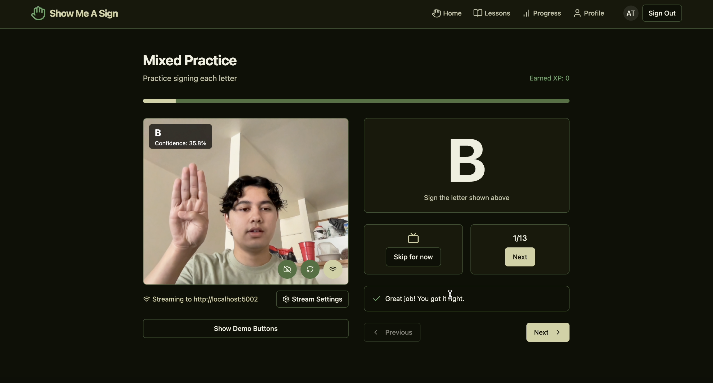
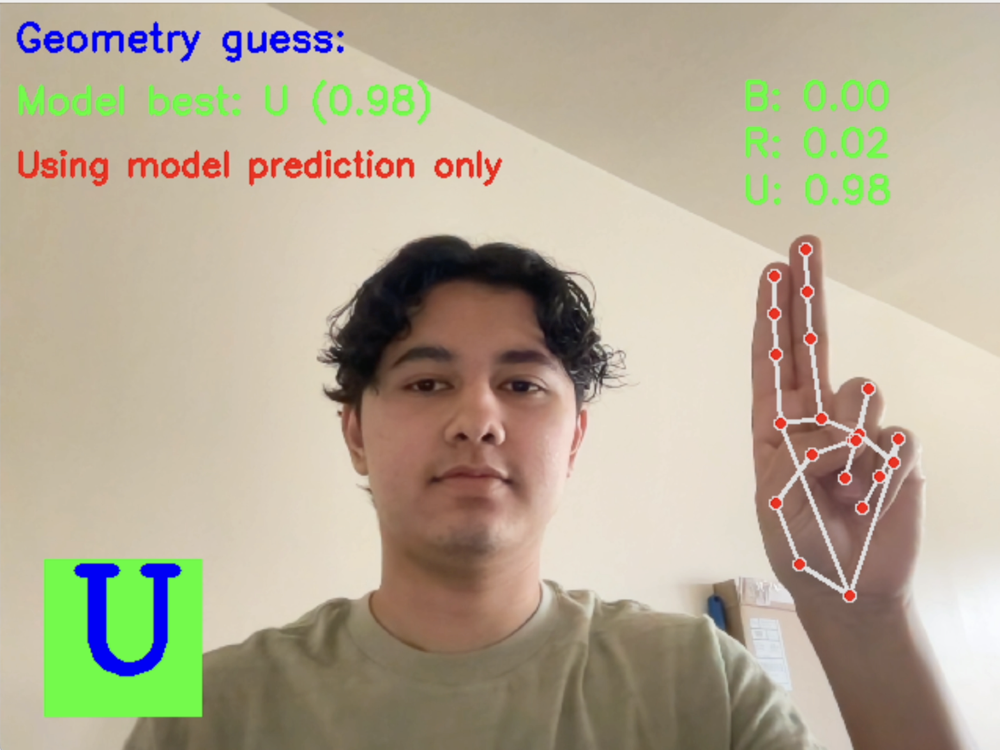
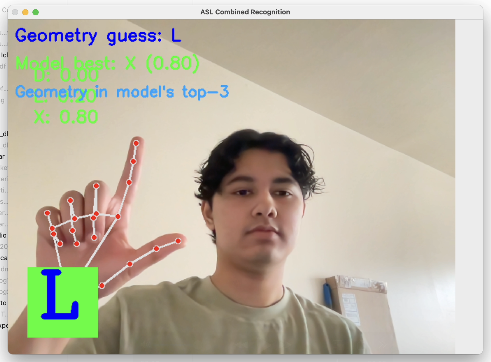

# Show Me A Sign - An Interactive ASL Learning Platform

## Project Overview

Show Me A Sign is an interactive web application designed to help users learn American Sign Language (ASL) through real-time webcam interaction. Using computer vision and machine learning, the platform provides immediate feedback on sign language gestures, helping users practice and master ASL.

### Key Features

- **Interactive ASL Learning**: Practice ASL signs with real-time feedback through your webcam
- **Structured Lesson Pathways**: Progress from alphabet to numbers and phrases
- **User Progress Tracking**: Track your learning journey with XP, achievements, and accuracy metrics
- **Adaptive Difficulty Levels**: Content organized by beginner, intermediate, and advanced levels
- **Visual Learning Aids**: Clear demonstrations of signs with practice opportunities
- **Real-time Sign Recognition**: Advanced ML model detects and evaluates hand signs

## Technical Architecture

The application consists of two main components:

### 1. Frontend (React + TypeScript)
- Built with React, TypeScript, and Vite
- UI components with shadcn/ui and Tailwind CSS
- Real-time webcam streaming with WebRTC
- User authentication and progress tracking via Supabase

### 2. Backend (Python + Flask)
- Flask-based WebSocket server for processing webcam frames
- Hand tracking using computer vision (OpenCV)
- ASL recognition with a trained machine learning model
- Real-time prediction with both CNN model and geometry-based analysis

